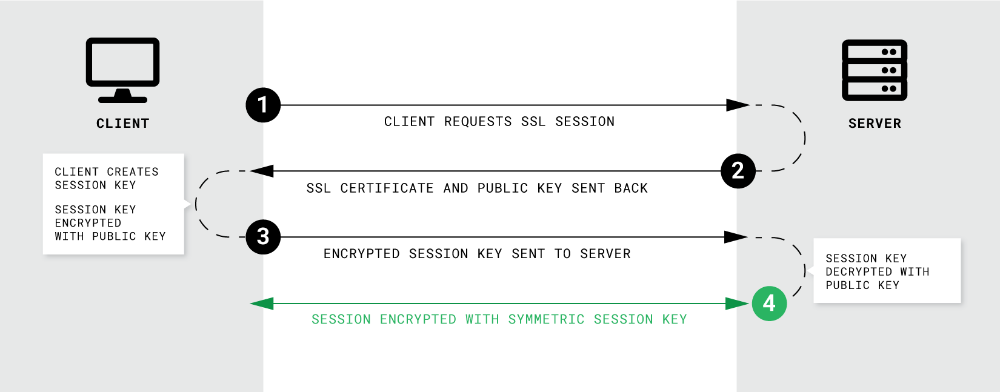

📝 *Subject : Creating a docker-based WordPress LEMP stack using docker-compose on Alpine Linux or Debian Buster. The whole project has to be done in our personal virtual machine.*

#  🐳 DOCKER

<details>
    <summary><h2> 🔎 WHAT’S DOCKER ?</h2></summary>
    Docker is a popular virtualization tool that replicates a specific operating environment on top of a host OS. Each environment is called a container. It allows you to deploy your application as a lightweight process set rather than a complete virtual machine.

### ⚡️ VM vs CONTAINER
<p align="center">
    
</p>

<p><br/><p/>


### 💻 DOCKER ENGINE

Docker engine is a part of Docker which create and run the Docker containers. It is the layer on which Docker runs and is installed on the host machine. It plays the controller's role.

<p> <p/>

<details>
    <summary>Docker CLI 👨‍💻</summary>
    <em>Command line interface used to perform actions: running/stopping containers...</em>
</details>

<details>
    <summary>REST API server 💻</summary>
    <em>Interface that programs can use to talk to the daemon and provides instructions.</em>
</details>

<details>
    <summary>Docker Daemon 😈</summary>
    <em>Background process that manages docker objects: images, containers, volumes, networks...</em>
</details>

<p><br/><br/><p/>

### 🏗 DOCKER ARCHITECTURE


📸  IMAGE
- read-only
- like a snapshot of a container’s file system and contain both your application and its dependencies
- is an immutable (unchangeable) file that contains the source code, libraries, dependencies, tools, and other files needed for an application to run
- essentially govern and shape containers
- can exist without containers

📦  CONTAINER
- read-write
- is a running environment of an image
- running a containerized environment means creating a read-write copy of that filesystem (docker image) inside the container
- needs to run an image to exist, is dependent on images
- once the task is complete, the container exits, it means a container only lives as long as the process inside it is alive

The two concepts exist as essential components (or rather phases) in the process of running a Docker container. Having a running container is the final “phase” of that process.

When a container is started, Docker loads the read-only image layer, adds a read-write layer on top of the image stack, and mounts volumes onto the container filesystem.

**🗂**  **VOLUME**

- used to persist data outside the container so it can be backed up or shared
- is an independent file system entirely managed by Docker and exists as a normal file or directory on the host, where data is persisted
- data gets automatically replicated
- folder in physical host file system is mounted into the virtual file system of docker
- 3 volumes type :
    - Host volumes : *[host_directory:container_directory]*
        
        You decide where on the host file system the reference is made
        
    - Anonymous volumes : *[container_directory]*
        
        For each container a volume is generated that gets mounted (automatically generated folder: /var/lib/docker/volumes/...)
        
    - Named volumes : *[name:container_directory]*

### ⌨️ DOCKER COMMANDS
<p align="center">

</p>


### 🔥 DOCKER ADVANTAGES
Docker containers enable developers to focus their efforts on application “content” by separating applications from the constraints of infrastructure.
Dockerized applications are instantly portable to any infrastructure – laptop, bare‑metal server, VM, or cloud – making them modular components that can be readily assembled and reassembled into fully featured distributed applications and continuously innovated on in real time.

A Docker container should have just one program running inside it. One container = one process.
But why is it recommended for a container to run just one process ? There are various benefits to running one process per container :
- **Isolation**: By placing each process in a separate container, you gain the benefits of isolating the process so that it can’t interfere with others.
- **Easier to scale**: When a container consists of just one single process, it is easier to scale the application by creating more instances of the container.
- **Easier to build and test**
- **Components can be upgraded independently**
- **Better reusability**: One of the benefits of a container-based application is that it can be run for different purposes and in different environments, by just changing its configuration. This makes a container like a building block. 
- **Easier to collect logs**
- **Simpler to manage with Docker**: Docker watches your application’s process (PID 1), and uses this to report the event that your container has stopped. 

</details>

<details>
<summary><h2>📄 DOCKERFILE</h2></summary>


<p align="left">
    <br /> A Dockerfile is a text document that contains all the commands a user could call on the command line to assemble an image. Docker can build images    automatically by reading the instructions from a Dockerfile.
</p>

<p align="center">
    <br /> <br /> <br />  
    
</p>

### ⚡️ CMD vs ENTRYPOINT
``` html
💡 ENTRYPOINT + CMD = default container command arguments
```
- CMD sets default command and/or parameters, which can be overwritten from command line when docker container runs. Has three forms :
    - CMD ["executable","param1","param2"] (exec form, preferred)
    - CMD ["param1","param2"] (sets additional default parameters for ENTRYPOINT in exec form)
    - CMD command param1 param2 (shell form)
- ENTRYPOINT configures a container that will run as an executable. The command and parameters are not ignored when Docker container runs with command line parameters (can still be ignored with option --entrypoint). Has two forms :
    - ENTRYPOINT ["executable", "param1", "param2"] (exec form, preferred)
    - ENTRYPOINT command param1 param2 (shell form -> ignores any CMD or docker run command line arguments)

When instruction is executed in shell form it calls /bin/sh -c <command>. When instruction is executed in exec form it calls executable directly, and shell processing does not happen.
``` html
📌 Recap : ENTRYPOINT arguments are always used, while CMD ones can be overwritten by command line arguments provided when Docker container runs.
```

### ⚠️ PID 1 Signal handler in Docker
The Linux kernel treats PID 1 as a special case, and applies different rules for how it handles signals. The process with PID 1 differs from the other processes in the following ways :

- When the process with pid 1 die for any reason, all other processes are killed with KILL signal.
- When any process having children dies for any reason, its children are reparented to process with PID 1.
- Many signals which have default action of Term do not have one for PID 1. It means you can’t stop process by sending SIGTERM or SIGINT, if process have not installed a signal handler.

Inside your container, the process running as PID 1 has special rules and responsibilities as the init system. If you run your container process wrapped in a shell script, this shell script will be PID 1 and will not pass along any signals to your child process. This means that `SIGTERM`, the signal used for graceful shutdown, will be ignored by your process.

So, having a shell as PID 1 actually makes signaling your process almost impossible. Signals sent to the shell won’t be forwarded to the subprocess, and the shell won’t exit until your process does. To avoid this problem, you should `exec` your last process so that it replaces the shell.

Alternatively, you can use an init-like process such as dumb-init with signal-proxying capabilities. It is a minimal init system intended to be used in Linux containers. Instead of executing your server process directly, you instead prefix it with dumb-init in your Dockerfile, such as `CMD ["dumb-init", "/bin/sh", "script.sh"]`. This creates a process tree that looks like:

- `docker run` (on the host machine)
    - `dumb-init` (PID 1, inside container)
            ‣ `/bin/sh script.sh` (PID 2, inside container)

Dumb-init spawns your process as its only child, and proxies signals to it. It won’t actually die until your process dies, allowing you to do proper cleanup. It also takes care of other functions of an init system, such as reaping orphaned zombie processes.
</details>


<details>
<summary><h2>🐙 DOCKER-COMPOSE</h2></summary>


``` html
💡 Docker Compose is a container orchestration technology that’s intended to run a number of containers on a single host machine.
```
``` html
🚪 Command to enter a container : docker exec -it container_name sh
```
</details>

# ♻️ LEMP STACK

<details>
    <summary><h2> 🔎 WHAT’S A LEMP STACK ?</h2></summary>
    
The subject requests us to create a LEMP stack :

- L stands for **Linux** as the operating system
- E for **Nginx** (pronounced as “Engine X”) as the web server
- M for **Mariadb** as the database
- P for **PHP** as a server-side scripting language that communicates with server and database

Every component of the stack communicates with each other :
<p align="center">
    
</p>
</details>

<details>
    <summary><h2>NGINX</h2></summary>
        
    
<h3> 🔐 SSL / TLS </h3>
The **server certificate** is a public entity. It is sent to every client that connects to the server.

The **private key** is a secure entity and should be stored in a file with restricted access, however, it must be readable by nginx’s master process.


<p> <br/> <p/>

    - HTTP  : Hypertext Transfer Protocol

    - HTTPS : HTTP Secure (HTTPS) = HTTP over TLS/SSL

    - SSL   : Secure Sockets Layer

    - TLS   : Transport Layer Security = successor to SSL

<p align="center">
    <br/> <br/> <br/>
    
    <br/> <br/>
</p>

-------

### 🔧 CONFIGURATION
/var/www/html : Web content, which by default only consists of the default Nginx page

/etc/nginx : Configuration directory. All of the Nginx configuration files reside here

/etc/nginx/nginx.conf : Main Nginx configuration file, consists of directives and their parameters
```html
📄 Config file : /etc/nginx/nginx.conf
```
Nginx test first IP_adress:port, then the server_name (if not found the request will be processed by the default_server). If the default server isn't defined, it selects the first server.

Nginx first searches for the most specific prefix location given by literal strings regardless of the listed order. Then nginx checks locations given by regular expression in the order listed in the configuration file. The first matching expression stops the search and nginx will use this location.
If no regular expression matches a request, then nginx uses the most specific prefix location found earlier.

At a high level, configuring NGINX as a web server is a matter of defining which URLs it handles and how it processes HTTP requests for resources at those URLs.
At a lower level, the configuration defines a set of virtual servers that control the processing of requests for particular domains or IP addresses.

Each location defines its own scenario of what happens to requests that are mapped to this location.

The root directive specifies the file system path in which to search for the static files to serve. The request URI associated with the location is appended to the path to obtain the full name of the static file to serve.

</details>

<details>
<summary><h2>MARIADB</h2></summary>

<p>
    <br/>
    MariaDB Server manages access to the MariaDB data directory that contains databases and tables. When MariaDB server starts, it listens for network connections from client programs and manages access to databases on behalf of those clients.
</p>

***mysqld*** is the actual MariaDB Server binary.

***mysqld_safe*** starts mysqld with some extra safety features, it is the recommended way to start mysqld server.

***mysql_install_db*** initializes the MariaDB data directory and creates the system tables in the mysql database, if they do not exist.

### 🔧 CONFIGURATION

Some MariaDB packages bind MariaDB to 127.0.0.1 (the loopback IP address) by default as a security measure using the bind-address configuration directive. If bind-address is bound to 127.0.0.1 (localhost), one can't connect to the MariaDB server from other hosts or from the same host over TCP/IP on a different interface than the loopback (127.0.0.1).

Configuring MariaDB for remote client access : bind-address = 0.0.0.0

If you want to create a user who can access your database from remote machines in MariaDB, then you can simply remove ‘localhost’ and add ‘%’. Now the user can access the specified database from remote machines too.
```html
📄 Config file : /etc/mysql/mariadb.conf.d/50-server.cnf
```
Connect to Local MariaDB Database Server :
```bash
docker exec -it mariadb sh
mysql -u user [login or root] -p
``` 
Connect to Remote MariaDB Database Server :
```bash
mysql -h 127.0.0.1 -u login -p
```

### ⌨️ MARIADB COMMANDS
- SHOW DATABASES;
- SELECT * from my_database.my_table;
or
- USE my_database;
SELECT * FROM my_table;
- SHOW TABLES;

</details>

<details>
<summary><h2>PHP-WORDPRESS</h2></summary>

WordPress is a Content Management System (CMS). It is a PHP based application written entirely in PHP. WordPress requires php-extensions to work properly.

WP-Cli : WordPress command line interface

We need to install ***mariadb-client*** in order to use ***mysqladmin***.
```html
📄 Config file : wp-config.php
```
### PHP-FPM
Unlike Apache which can handle PHP processing directly, Nginx doesn't know how to run a PHP script of its own. It must rely on a separate PHP processor to handle PHP requests, like PHP-FPM.

PHP-FPM is a PHP-FastCGI Process Manager. It is a PHP language interpreter and manage php requests.

Nginx server will handle HTTP requests only, while PHP-FPM interprets the PHP code. When a user requests a PHP page the Nginx server will pass the request to PHP-FPM service using FastCGI porotocol. PHP-FPM runs outside the Nginx environment by creating its own process.

PHP-FPM can listen on Unix sockets or TCP sockets (that's what we use here).
```html
📄 Config file : /etc/php/7.3/fpm/pool.d/www.conf
```

</details>


 # ⚙️ VM CONFIG

<details>
<summary><h2>🔩 CONFIGURATION</h2></summary>

[📌 README to setup our VM](https://github.com/llescure/42_Inception)

- Create a new user and assign it to the different groups :
```bash
sudo adduser login
sudo usermod -aG sudo login
sudo usermod -aG docker login
```
- Edit /etc/hosts file to add our server name to the list of host accepted (will only affects the local computer) :
```bash
ip-address      custom_name
127.0.0.1       login.42.fr
```
The /etc/hosts file contains a mapping of IP addresses to URLs. Our browser uses entries in this file to override the IP-address-to-URL mapping returned by a DNS server.
- Remove the previous version of docker-compose and download the latest version :
```bash
sudo apt-get remove docker-compose
sudo rm -f /usr/local/bin/docker-compose
```
```bash
sudo curl -L "[https://github.com/docker/compose/releases/download/1.29.2/docker-compose-$](https://github.com/docker/compose/releases/download/v2.6.1/docker-compose-$)(uname -s)-$(uname -m)" -o /usr/local/bin/docker-compose
sudo chmod +x /usr/local/bin/docker-compose
```
- Stop running services Nginx and MySql :
```bash
sudo service nginx stop
sudo service mysql stop
```
</details>

# 👉🏻 RECAP’

